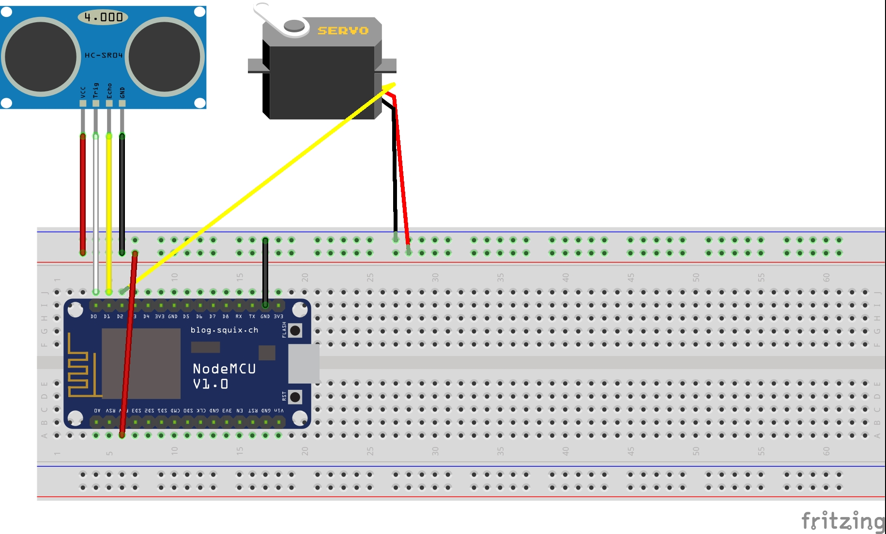

## CarSheduling - CarBarrier 하드웨어 환경 설정
### Hardware 구성
<li>Arduiono Board : keyestudio ESP8266 wifi board</li>
<li>Servo Motor : MG90S servo</li>
<li>Ultrasonic Senosr : HC-SR04</li>

---

### Schematic

