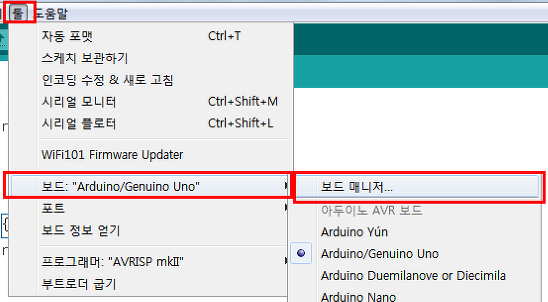
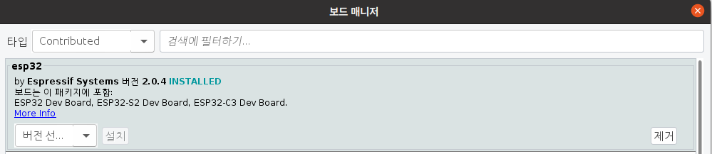

## Arduino ESP32-CAM 환경 설정
### test 및 시연 환경
<li>OS : Ubuntu 20.04.5 LTS</li>
<li>IDE : Arduino 1.8.19</li>
<li>Device : AI Thinker ESP32-CAM</li>

### ESP32 초기 설정

 
1. 파일 -> 환경설정

 
2. 추가적인 보드 매니저 URLs에 https://raw.githubusercontent.com/espressif/arduino-esp32/gh-pages/package_esp32_index.json 추가

 
3. 툴 -> 보드 -> 보드 매니저...

 
4. 타입 = Contributed -> esp32 검색 -> esp32 by Espressif Systems 버전 2.0.4 설치

--- 
### AI Thinker ESP32-CAM 초기 설정
1. 툴 -> 보드 -> ESP32 -> Arduino AI Thinker ESP32-CAM
2. 툴 -> Partition Scheme -> HugeAPP(3MB No OTA/1MB SPIFFS)
