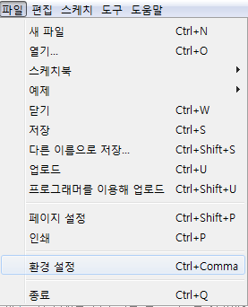
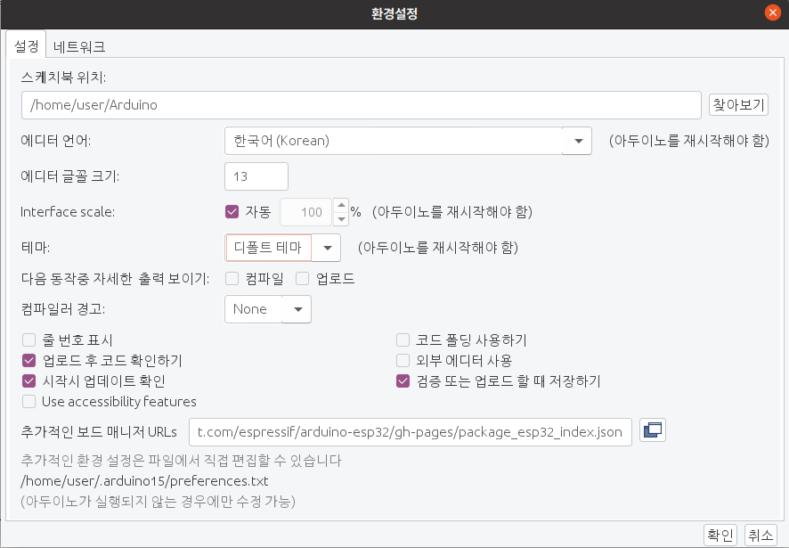

## Arduino ESP32-CAM 환경 설정
### test 및 시연 환경
<li>OS : Ubuntu 20.04.5 LTS</li>
<li>IDE : Arduino 1.8.19</li>
<li>yarn version : 1.22.19</li>
<li>ENACT-CLI version : 5.0.1</li>

### ESP32 초기 설정


<br/>
파일 -> 환경설정

<br/>
추가적인 보드 매니저 URLs에 https://raw.githubusercontent.com/espressif/arduino-esp32/gh-pages/package_esp32_index.json 추가

--- 
### ESP32-CAM 초기 설정
기본적으로 ares-setup-device에서 자신의 webOS가 default로 설정되어 있음을 전제로 하고 있음을 알려드립니다.

```bash
npm install
yarn install

npm run pack-p
ares-package dist -o ipk

ares-install ipk/<app_name>
```
혹은

```bash
sh setup.sh
```
