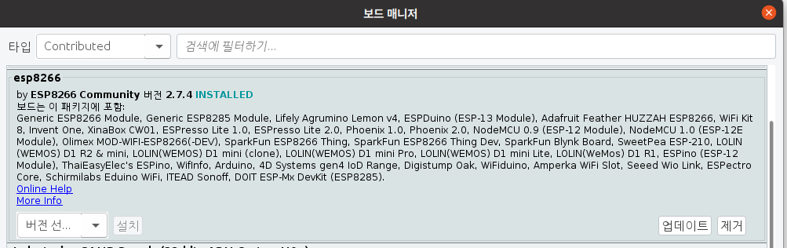

### test 및 시연 환경
<li>OS : Ubuntu 20.04.5 LTS</li>
<li>IDE : Arduino 1.8.19</li>
<li>Device : KEYESTUDIO ESP8266</li>

### KEYESTUDIO ESP8266 초기 설정

 
1. 파일 -> 환경설정

 
2. 추가적인 보드 매니저 URLs에 http://arduino.esp8266.com/stable/package_esp8266com_index.json 추가

 
3. 툴 -> 보드 -> 보드 매니저...

 
4. 타입 = Contributed -> esp8266 검색 -> esp8266 by ESP8266 Community 버전 2.7.4 설치
  
5. 툴 -> 보드 -> ESP8266 Boards (2.7.4) -> Generic ESP8266 Module
